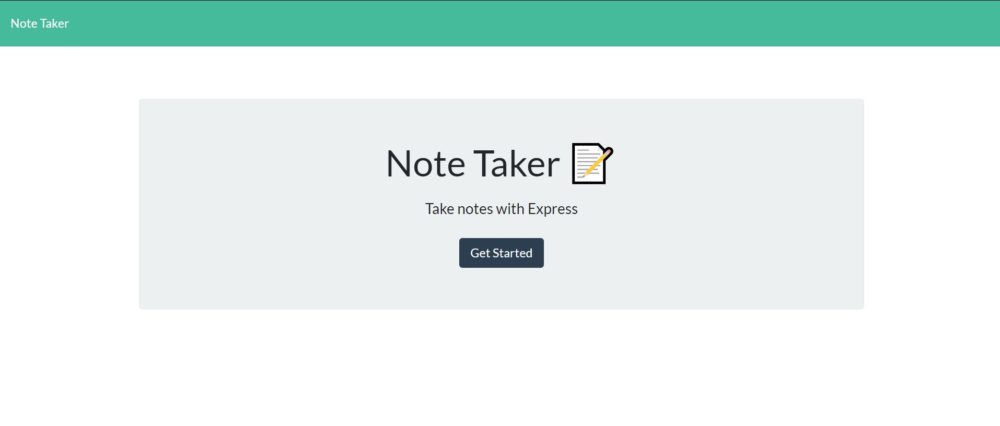

# Note_Taker

https://lit-wildwood-25379.herokuapp.com/

## Description

This is a note taking application that uses express backend to save and retrieve note data from a JSON file.

Upon load the user is taken to the home screen. 

Upon clicking on Get Started, the URL appends `/notes` and returns the `notes.html` file. 

THe added notes are stored in a `db.json` file on the backend. The `fs` module is used to read and write to this file.

